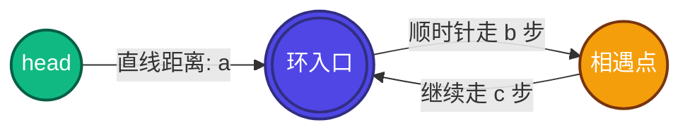

# 🔗 双指针与环形链表Ⅱ：寻找环入口的数学奥秘

## 🎨 算法示意图与核心变量



### 📏 变量定义
*   **$a$**：从 **头节点（head）** 到 **环入口（Entrance）** 的直线路径长度。
*   **$b$**：从 **环入口（Entrance）** 顺时针走到 **快慢指针相遇点（Meeting Point）** 的路径长度。
*   **$c$**：从 **相遇点（Meeting Point）** 顺时针继续走，回到 **环入口（Entrance）** 的剩余环路长度。
*   **$L$**：环的总长度，显然 **$L = b + c$**。

---

## 📐 数学证明与推导

### 第一阶段：相遇时的距离方程
快指针 `fast` 每次走 **2 步**，慢指针 `slow` 每次走 **1 步**。当它们在“相遇点”首次相遇时：

1.  **慢指针 `slow` 走的距离**：
    $$S = a + b$$
    *(为什么 `slow` 进环后不需要绕满一整圈就会被相遇？因为两指针都在环里时，`fast` 每走一次就比 `slow` 多走 1 步，两者的相对距离每步缩短 1。因为最初两人的环路距离小于环长 $L$，所以 `slow` 还没走完一整圈，`fast` 必然已经追上了。)*

2.  **快指针 `fast` 走的距离**：
    $$F = a + n \cdot L + b$$
    *(其中 $n$ 是 `fast` 指针在环里多绕的圈数，且 $n \ge 1$)*

由于快指针的速度是慢指针的 2 倍，且时间相同，因此在相遇时：
$$F = 2 \cdot S$$

将两者的距离方程代入上式中：
$$a + n \cdot L + b = 2(a + b)$$

展开并化简方程：
$$a + n \cdot L + b = 2a + 2b$$
$$n \cdot L = a + b$$
$$a = n \cdot L - b$$

---

### 第二阶段：精妙的环结构化简
为了让 “相遇点到环入口的距离 $c$” 显现出来，我们把其中一个 $L$ 拆开：
$$a = (n - 1) \cdot L + L - b$$

因为环长 $L = b + c$，所以有 $L - b = c$。我们将它代入公式，得到最终的**黄金关联式**：
$$a = (n - 1) \cdot L + c$$

> [!IMPORTANT]
> **这行黄金等式代表什么？**
> *   **左边 $a$**：从 **头节点** 走到 **环入口** 的距离。
> *   **右边 $c + (n - 1) \cdot L$**：从 **相遇点** 走到 **环入口** 的距离，加上若干圈整环。
> 
> **结论**：如果我们在相遇后，让一个指针 `left` 从头节点出发，另一个指针 `right` 从相遇点出发，它们以**相同的速度（每次走1步）**向前走。
> 当 `left` 走过距离 $a$ 到达**环入口**时，`right` 也走过了相同的距离。因为比 $c$ 多走的都是环的整圈数，它转完圈最终也会停留在**环入口**。
> 
> **因此，它们必定在“环入口”完美会师！**

---

## 📊 具象化数字代入（秒懂模拟）

假设我们有如下链表结构：
*   **$a = 3$** （直线距离为 3：`0 -> 1 -> 2 -> 3`，`3` 是环入口）
*   **$L = 5$** （环长为 5：`3 -> 4 -> 5 -> 6 -> 7 -> 3`）

### 1️⃣ 寻找相遇点阶段
两指针同时从头节点 `0` 出发：

| 步数 | `slow` 位置 | `fast` 位置 | 备注 |
| :--- | :--- | :--- | :--- |
| **0** | `0` (head) | `0` (head) | 出发 |
| **1** | `1` | `2` | - |
| **2** | `2` | `4` | - |
| **3** | `3` (入口) | `6` | 慢指针到达入口 |
| **4** | `4` | `3` | 快指针从 6 越过 7 回到 3 |
| **5** | `5` | `5` | **相遇在节点 5！** |

此时，相遇点为 **节点 5**：
*   $a = 3$
*   $b = 2$ （入口 3 走到相遇点 5 需走两步：3 ➔ 4 ➔ 5）
*   $c = 3$ （相遇点 5 回到入口 3 需走三步：5 ➔ 6 ➔ 7 ➔ 3）
*   由于快慢指针在 $n=1$ 时相遇，代入公式：$3 = (1 - 1) \times 5 + 3 \implies 3 = 3$ 完美吻合！

### 2️⃣ 寻找入口节点阶段
在节点 5 相遇后，让 `left` 指向头节点 `0`，`right` 依然停在相遇点 `5`，它们每次只走 1 步：

| 步数 | `left` 位置 | `right` 位置 | 状态描述 |
| :---: | :---: | :---: | :--- |
| **0** | `0` | `5` | `left` 从头出发，`right` 从相遇点出发 |
| **1** | `1` | `6` | - |
| **2** | `2` | `7` | - |
| **3** | `3` | `3` | **共同抵达入口 节点 3，成功返回！** |

---

## 💻 核心实现代码

```typescript
function detectCycle(head: ListNode | null): ListNode | null {
    let slow = head, fast = head;
    
    // Step 1: 寻找快慢指针相遇点（判断有环）
    while (fast && fast.next) {
        slow = slow!.next;
        fast = fast.next.next;
        
        // 首次相遇
        if (slow === fast) {
            // Step 2: 证明 $a = c + (n - 1)L$，启用双指针同速寻找入口
            let left = head;
            let right = slow; // right 放在相遇点
            
            while (left !== right) {
                left = left!.next;
                right = right!.next;
            }
            return left; // 返回环的第一个节点（入口）
        }
    }
    
    return null; // 无环情况
}
```

---

## 💡 记忆金句
> 遇到环形链表Ⅱ：**“快慢相遇，一个回起点，一个留原地，同速前进，终会相约在入口。”**
